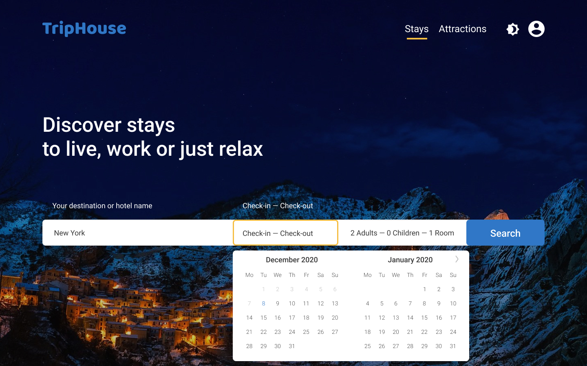
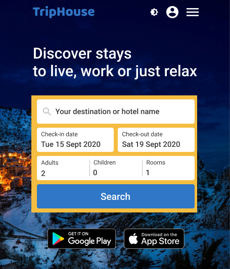

# TripHouse

[Watch demo](https://evgenywas.github.io/triphouse/)

Email: admin@triphouse.com
Password: admintriphouse

> Home page preview

> Mobile home page preview

### Summary
On this project, I honed my work with the API, tried working with the Redux state manager and used Redux-saga for asynchronous middlewares. I also used Context for some features. I used React-router-dom for routing and I used Firebase for authentication. And I tried the basics of testing with Just and Enzyme on this project.
It was a cool project to test all the features in order to improve some of the following projects in the future.